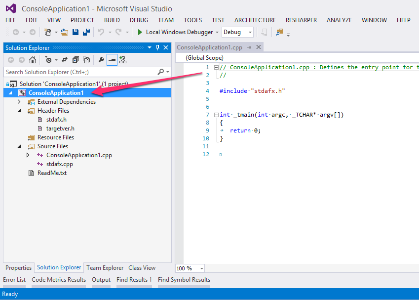
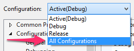
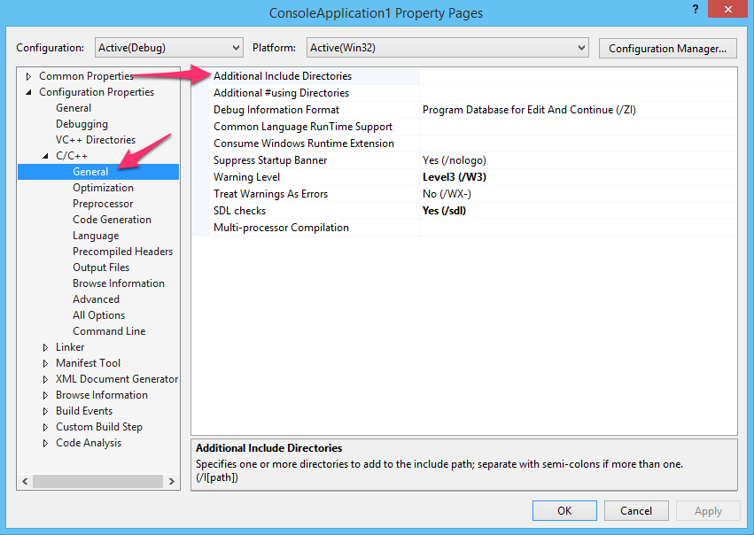
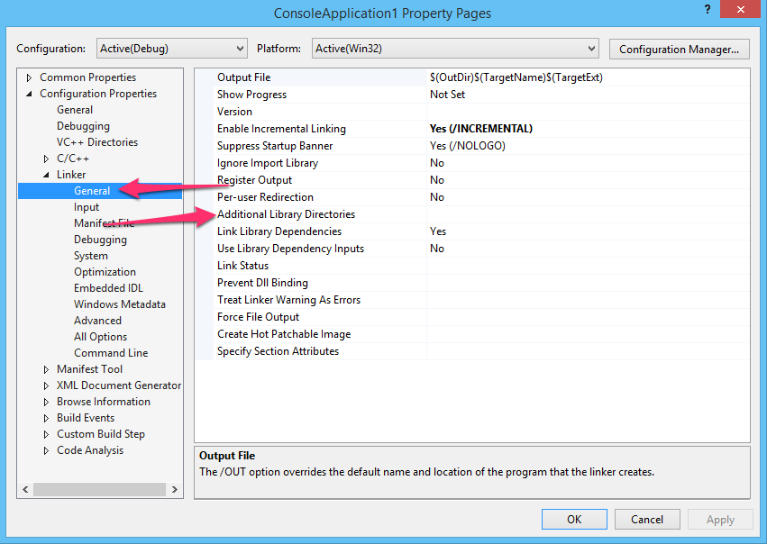
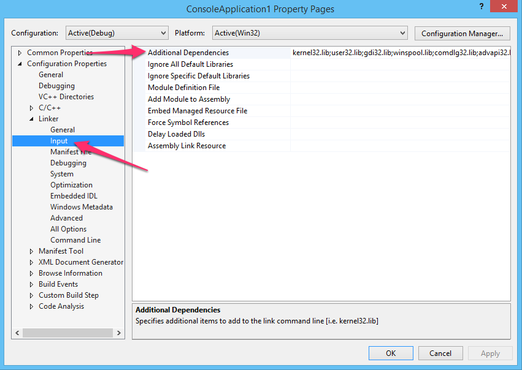
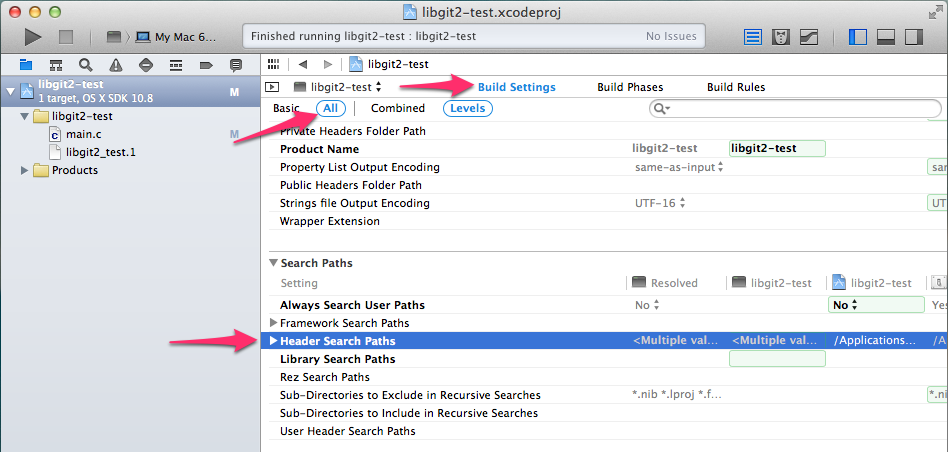
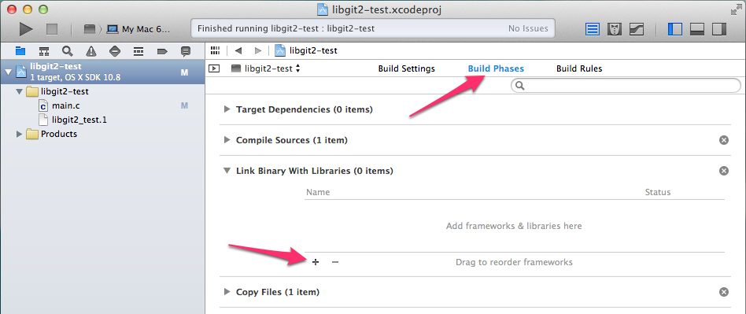
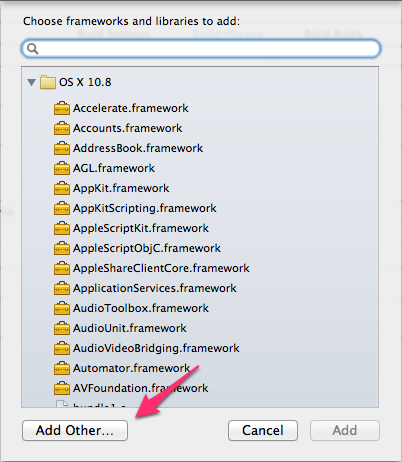

# How to Build Libgit2

There is no One True Way™ to use an open-source C library.
This article provides some guidance on how to use libgit2 with various build/project tools.

## Basic Build

Libgit2 is developed with [CMake](http://www.cmake.org/), and this will be the easiest way to build a binary from the source.
Once you have CMake installed, performing a libgit2 build is fairly simple.
In a shell session with the libgit2 root directory as the cwd, simply do this:

```bash
$ mkdir build
$ cd build
$ cmake ..
$ cmake --build .
```

On posix-type systems, the output is typically `./libgit2.so`; on Windows, it's usually `Debug\git2.dll`.

This also builds libgit2's unit-test suite; to run it, just run `./libgit2_clar` or `Debug\libgit2_clar.exe`.

### Notes for Visual Studio Users

The commands above should be run from within a Visual Studio command prompt; an SDK prompt will not work.
The default set of commands above result in a build that's the same bitness as your command prompt – a command prompt configured for 64-bit cross-compile tools will result in a 64-bit `git2.dll`.
Also note that CMake is generating a Visual Studio solution file and several project files, and by default it chooses the latest version of Visual Studio that's installed on your machine.

If you want to change either of these defaults, you have to specify a "generator" to CMake using the `-G` flag.

| VS Version | Command Line |
| ---------- | ------------ |
| Visual Studio 2010 (x86) | `cmake -G "Visual Studio 10" ..` |
| Visual Studio 2010 (amd64) | `cmake -G "Visual Studio 10 Win64" ..` |
| Visual Studio 2012 (x86) | `cmake -G "Visual Studio 11" ..` |
| Visual Studio 2012 (amd64) | `cmake -G "Visual Studio 11 Win64" ..` |

Visual Studio 2013 isn't supported yet, but it probably will be in the next release of CMake.

## Advanced Build

The CMake build system provides lots of options to configure the libgit2 build for your particular needs.
These are set by passing `-D<variable>=<value>` to CMake during the project-file generation step.
Here are some of the most useful:

| Option | Notes |
| --- | --- |
| `BUILD_SHARED_LIBS` | This defaults to `ON`, which produces dynamic libraries (DLLs on Windows). Set it to `OFF` if you want the build to generate static libraries. |
| `CMAKE_BUILD_TYPE` | This selects the build configuration; available options are `Debug` (the default), `Release`, and `RelWithDebInfo`. In the case of Visual Studio and other multi-configuration project systems, this selects the default build configuration. |
| `BUILD_CLAR` | Selects whether the unit-test suite is built. This defaults to `ON`; set to `OFF` for a faster build. |
| `THREADSAFE` | Selects whether libgit2 tries to be threadsafe. This defaults to `OFF`, but unless you **know** your application will only be single-threaded, it's recommended you turn it `ON`. |
| `LIBGIT2_FILENAME` | Sets the basename of the output binary. For example, if this is set to `foo`, the output will be something like `foo.dll` or `foo.so`. This option is useful to know what version of libgit2 was built, if your build system doesn't embed that information into the binary. |
| `STDCALL` | *(MSVC Only)* By default, libgit2 builds with the `cdecl` calling convention.  If you're working with Win32 or the CLR, set this to `ON` to build with the `stdcall` convention. |
| `STATIC_CRT` | *(MSVC Only)* By default, libgit2 will link to a DLL version of the C runtime. Set this to `ON` if you want the runtime functions linked statically. |

Take a look at the [`CMakeLists.txt`](https://github.com/libgit2/libgit2/blob/development/CMakeLists.txt) file for more information.

# Linking and Usage

Once you have a build, you probably want to use it from within your application.
You'll need to include `git2.h`, and link to the binaries you built previously.

## Visual Studio

Your Visual Studio project will need to know where to find the libgit2 headers and link libraries.
Open up the project settings by clicking on the project in the Solution Explorer, and selecting `Properties`.

[](vs-0.png)

Make sure you're configuring the proper build configuration:

[](vs-1.png)

Add `C:\path\to\libgit2\include` to "Additional Include Directories" under "C/C++ > General".

[](vs-2.png)

The linker will need to know where to find the `git2.lib` file.
Add `C:\path\to\libgit2\build\Debug` to "Linker > General > Additional Library Directories".
You may want to configure this path differently for a Release build.

[](vs-3.png)

Finally, add `git2.lib` to the list of libraries to link in:

[](vs-4.png)

If you built libgit2 as a static library, you're done!
If it's a DLL, you'll have to make sure that `git2.dll` gets into the same directory as your output EXE file.
You can do this with a post-build script (check "Build Events"), or by including the `git2.vcxproj` file in your solution, and changing its output directory to match where the rest of your binaries go.

## XCode

Your search paths will need to be modified to include the location of the libgit2 headers and binaries.
In Xcode 5, open the project node, open the `Build Settings` tab, make sure all settings are shown, and look for `Header Search Paths`:

[](xcode-headers.png)

If you're working from a source distribution, the include path to add is `/path/to/libgit2/include`, and the library path is `/path/to/libgit2/build`.
You can add this to the target or the entire project.

Next you'll have to link to the right binary library.
Switch to the "Build Phases" tab, and under `Link Binary With Libraries`, click the "+":

[](xcode-link1.png)

Then select "Add Other…":

[](xcode-link2.png)

Browse to the location where the libgit2 binaries are located (if you're working from source, this is `/path/to/libgit2/build`), select the `libgit2.dylib` file, and click OK.


## Makefiles

The binaries that are output from the build are dependent on the build system you're using.
On posix-type systems, the output is typically a `libgit2.so` (or `libgit2.a` if you built statically).

Using these files is dependent on your application's project system.
For a Makefile-based build, this is what you'll need:

```
CFLAGS += -I/path/to/libgit2/include
LDFLAGS += -L/path/to/libgit2/binaries
LIBRARIES += -lgit2
```
